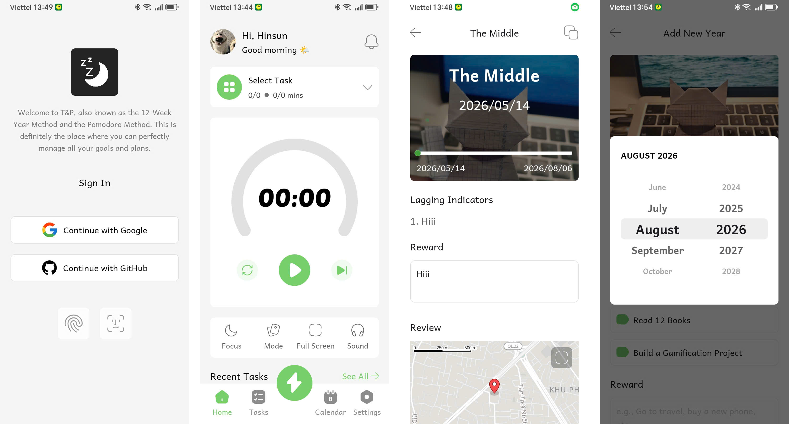

# FlosunPomodoro

A combined 12 Week Year and Pomodoro Technique app to help you control your time and achieve your goals effectively. With customizable timers, goal tracking, and smart notifications, FlosunPomodoro is your ultimate productivity companion.



## Features

- 🍅 **Pomodoro Timer**: Classic Pomodoro timer with customizable work and break intervals
- 🎯 **Goal Tracking**: Create, update, and manage your productivity goals with progress tracking
- 🔔 **Smart Notifications**: Customizable notification preferences for timer events
- 🌙 **Appearance Customization**: Dark/light theme support with Material 3 design
- 🗣️ **Multi-Language Support**: Built-in language preferences
- 🔐 **Secure Authentication**: 
  - Email/password login and registration
  - Biometric authentication (fingerprint/face recognition)
  - Google Sign-In integration
- ☁️ **Cloud Synchronization**: Real-time sync via Supabase backend
- 📊 **Progress Dashboard**: View your productivity metrics and goal progress
- 🗺️ **Location Features**: Integrated maps support (Google Maps & MapLibre)
- 🎵 **Media Support**: Built-in audio playback for timer sounds and notifications

## Tech Stack

### Core Framework
- **Language**: Kotlin 2.3.21
- **Compose**: Jetpack Compose (Material 3)
- **Build System**: Gradle 9.1.1 (Kotlin DSL)

### Architecture & Dependency Injection
- **Architecture**: MVVM (Model-View-ViewModel)
- **DI**: Hilt with KSP (Kotlin Symbol Processing)
- **Navigation**: Navigation 3 with custom NavBackStack

### Database & Storage
- **Local DB**: Room 2.8.4 (SQLite)
- **Cloud Backend**: Supabase (Postgrest, Auth, Realtime)
- **Preferences**: DataStore with encrypted storage (AES)

### Authentication & Security
- **Biometric**: AndroidX Biometric 1.4.0
- **Google Credentials**: Google Identity Services
- **Backend Auth**: Supabase Auth

### UI & Networking
- **Networking**: Ktor 3.4.3 client
- **Image Loading**: Coil 3.4.0
- **Serialization**: Kotlinx Serialization 1.11.0
- **Media**: Media3 (ExoPlayer)
- **Maps**: Google Maps Compose + MapLibre Compose

### Testing
- **Unit Tests**: JUnit 4.13.2
- **Instrumented Tests**: Espresso 3.7.0
- **Lifecycle Testing**: Lifecycle Runtime 2.10.0

## Project Structure

```
FlosunPomodoro/
├── app/                          # Main application module
│   ├── src/main/java/com/flosun/pomodoro/
│   │   ├── presentation/         # UI screens (MVVM)
│   │   │   ├── auth/            # Login & registration
│   │   │   ├── goals/           # Goal management
│   │   │   ├── timer/           # Pomodoro timer
│   │   │   ├── dashboard/       # Main dashboard
│   │   │   ├── settings/        # Settings & preferences
│   │   │   ├── notification/    # Notification settings
│   │   │   └── swipe/           # Swipe-based navigation
│   │   ├── domain/              # Business logic & interfaces
│   │   ├── data/                # Data layer (DB, API, repositories)
│   │   └── di/                  # Hilt dependency injection
│   ├── build.gradle.kts         # App build configuration
│   └── schemas/                 # Room database schemas
├── core/                         # Shared Compose UI components
│   ├── src/main/java/com/flosunn/core/
│   └── build.gradle.kts
├── libraries/                    # Prebuilt binary dependencies
├── gradle/
│   └── libs.versions.toml       # Centralized dependency versions
├── fastlane/                    # CI/CD automation
│   ├── Fastfile               # Build lanes
│   ├── Gemfile
│   └── workflows/
├── build.gradle.kts             # Root build configuration
├── settings.gradle.kts          # Project configuration
└── local.properties             # Local configuration (not committed)
```

## Prerequisites

- **JDK**: 17 or higher
- **Android SDK**: API 36 (compileSdk)
- **Min SDK**: API 24
- **Gradle**: 9.1.1+

## Setup & Configuration

### 1. Clone the Repository
```bash
git clone https://github.com/Vanhoai/FlosunPomodoro
cd FlosunPomodoro
```

### 2. Create Local Configuration Files

#### `local.properties` (Required)
Create this file at the project root with:
```properties
versionCode=1
versionName=1.0.0

# Supabase Configuration
supabaseUrl=your_supabase_url_here
supabasePublishableKey=your_supabase_key_here

# Google OAuth Configuration
googleClientId=your_google_client_id_here
googleClientSecret=your_google_client_secret_here
```

#### `keystore.properties` (Already committed with dev credentials)
Contains debug/release signing configuration:
```properties
debug_keystore_file=debug.keystore
debug_keystore_password=android
debug_key_alias=androiddebugkey
debug_key_password=android
```

### 3. Install Dependencies
```bash
# Sync Gradle (automatic on first build)
./gradlew sync
```

## Building & Running

### Build Variants

```bash
# Full build (app + core modules)
./gradlew assembleDebug

# App-only build (skip core if already built)
./gradlew :app:assembleDebug

# Release build
./gradlew assembleRelease

# Install on device/emulator
./gradlew installDebug
```

### Run the App
```bash
# Using Android Studio
# 1. Open project in Android Studio
# 2. Click "Run" or press Shift+F10

# Using Gradle
./gradlew :app:installDebug
```

## Testing

### Run All Tests
```bash
# Unit tests
./gradlew test

# App unit tests only
./gradlew :app:test

# Core unit tests only
./gradlew :core:test

# Instrumentation tests (requires emulator/device)
./gradlew connectedAndroidTest
```

## CI/CD Pipeline

The project uses **Fastlane** for automation:

```bash
# Install dependencies (first time only)
cd fastlane
bundle install
cd ..

# Run test lane
bundle exec fastlane android test

# Build and upload beta to Crashlytics
bundle exec fastlane android beta

# Deploy to Play Store
bundle exec fastlane android deploy

# Distribute via Firebase App Distribution
bundle exec fastlane android distribute
```

See `fastlane/Fastfile` for full lane definitions.

## Key Development Notes

### Architecture
- **MVVM Pattern**: Screens use ViewModel for state management
- **Navigation 3**: Custom navigation with `NavBackStack` and sealed class routes
- **Compose Material 3**: Modern Material Design components
- **Hilt DI**: Automatic dependency injection with KSP compilation

### Database
- **Room**: Type-safe database abstraction with coroutine support
- **Schemas**: Exported to `app/schemas/` for version management
  - Note: Two namespace directories exist (one has a typo with double `n`)

### Modules
- **`:app`**: Main MVVM screens, Room DB, DI, services, Compose UI
- **`:core`**: Reusable Compose components (date/time pickers, custom UI elements)
- **`:libraries`**: Prebuilt binary dependencies (shared.aar)

### Namespace Note
- `:app` namespace: `com.flosun.pomodoro`
- `:core` namespace: `com.flosunn.core` (intentional double `n`)

### Build Features
- **ProGuard**: Currently disabled (`isMinifyEnabled = false`)
- **ABIs**: Optimized for `arm64-v8a` only
- **KSP**: Replaces kapt for annotation processing (faster compilation)
- **Compose Compiler**: Built-in, no manual dependency needed

## Dependency Highlights

| Category | Libraries |
|----------|-----------|
| **DI** | Hilt 2.59.2 + KSP |
| **DB** | Room 2.8.4 + KSP |
| **Backend** | Supabase 3.6.0 (Auth, Postgrest, Realtime) |
| **Networking** | Ktor 3.4.3 |
| **Auth** | Google Credentials 1.6.0, Biometric 1.4.0 |
| **UI** | Material 3, Compose BOM 2026.04.01 |
| **Image** | Coil 3.4.0 |
| **Media** | Media3 1.10.0 |
| **Maps** | Google Maps Compose + MapLibre Compose |
| **Storage** | DataStore 1.2.1, Encrypted Storage (AES) |

## Troubleshooting

### Common Issues

1. **Gradle Sync Fails**
   - Ensure `local.properties` is configured correctly
   - Run `./gradlew clean` then rebuild

2. **Build Fails - Missing Properties**
   - Verify `local.properties` contains `versionCode` and `versionName`
   - Check Supabase and OAuth credentials

3. **Compose Compilation Errors**
   - Clear build cache: `./gradlew clean`
   - Invalidate Android Studio cache: File → Invalidate Caches

4. **Tests Fail**
   - Ensure emulator/device is connected for instrumented tests
   - Check test device API level is ≥ 24

### Debug Logging
The app uses **Timber** for structured logging:
```kotlin
Timber.d("Debug message")
Timber.e("Error: %s", exception)
```

## Development Workflow

### Code Style
- **Language**: Official Kotlin style guide
- **Compose**: Best practices from Google Codelab
- **Comments**: Only when logic needs clarification
- **Naming**: Descriptive kebab-case for resources, PascalCase for classes

### Git Workflow
```bash
# Create feature branch
git checkout -b feature/your-feature

# Make changes and test
./gradlew test

# Commit with message
git commit -m "Add feature description"

# Push and create PR
git push origin feature/your-feature
```

### Adding Dependencies
Edit `gradle/libs.versions.toml` (single source of truth):
```toml
[versions]
myLibVersion = "1.0.0"

[libraries]
myLib = { group = "com.example", name = "mylib", version.ref = "myLibVersion" }
```

Then use in `build.gradle.kts`:
```kotlin
dependencies {
    implementation(libs.myLib)
}
```

## Performance Considerations

- **Minimum SDK 24**: Balances compatibility with modern APIs
- **arm64-v8a Only**: Reduces APK size, targets modern devices
- **ProGuard Disabled**: Trade-off for faster development/testing
- **Coil Image Loading**: Efficient async image loading with caching
- **Room Coroutines**: Non-blocking database operations

## Support & Contributing

For issues, feature requests, or contributions:
1. Open an issue with detailed description
2. Fork and create a feature branch
3. Submit a pull request with tests

## Resources

- [Pomodoro Technique](https://en.wikipedia.org/wiki/Pomodoro_Technique)
- [Jetpack Compose Documentation](https://developer.android.com/jetpack/compose)
- [Kotlin Coroutines](https://kotlinlang.org/docs/coroutines-overview.html)
- [Room Database](https://developer.android.com/training/data-storage/room)
- [Hilt Documentation](https://dagger.dev/hilt/)
- [Supabase Documentation](https://supabase.com/docs)